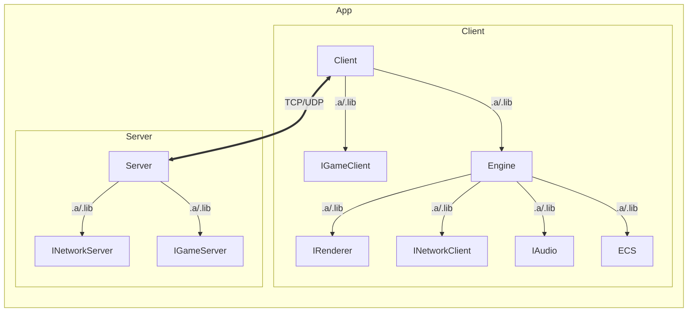

<p align="center">
  
</p>

# R-Type
[](https://github.com/bobis33/R-Type/actions/workflows/gitleaks.yml)
[](https://github.com/bobis33/R-Type/actions/workflows/ci.yml)
[](https://github.com/bobis33/R-Type/actions/workflows/deploy-doxygen.yml)
[](https://github.com/bobis33/R-Type/actions/workflows/mirror.yml)

The Goal of this project is to implement a multithreaded server and a graphical client for a game called R-Type, using an engine of your own design.

## Supported Platforms
| Platform | Compiler | Status |
|----------|----------|--------|
| Linux    | g++      | ✅      |
| macOS    | g++      | ✅      |
| Windows  | MSVC     | ✅      |

## Project Structure

```text
R-Type
├── assets                  # Game assets (images, sounds, etc.)
├── cmake                   # Cmake configs
├── client                  # Client source code
├── documentation           # Project documentation
├── modules                 # Static libraries for the project
├── scripts                 # Build and utility scripts
├── server                  # Server source code
├── tests                   # Unit and integration tests
└─── third-party            # External libraries as submodules
```

## Build and Run
> [!IMPORTANT]
> When cloning the project, you should also initialize the submodules:
> ```bash
> git clone --recurse-submodules git@github.com:bobis33/R-Type.git
> ```
> If you already cloned the project, you can initialize the submodules with:
> ```bash
> git submodule update --init --recursive
> ```
### Prerequisites
Make sure you have the following dependencies installed on your system:

- [CMake 4.0.0](https://cmake.org/)
- [C++23](https://en.cppreference.com/w/cpp/23)
### Unix (Linux, macOS)
```bash
./scripts/unix/build.sh release
## Or
cmake -S . -B cmake-build-release -G "Ninja" -DCMAKE_BUILD_TYPE=Release -DCMAKE_CXX_COMPILER=g++ -DCMAKE_C_COMPILER=gcc
cmake --build cmake-build-release -- -j4
## Then
./cmake-build-release/bin/r-type_client ## client
./cmake-build-release/bin/r-type_server ## server
```

### Windows
```powershell
cmake -S . -B cmake-build-release -G "Visual Studio 17 2022" -A x64 -DCMAKE_BUILD_TYPE=Release
cmake --build cmake-build-release --config Release
## Then
cmake-build-release\bin\r-type_client.exe ## client
cmake-build-release\bin\r-type_server.exe ## server
```

## Documentation

API documentation is generated using Doxygen and deployed on [GitHub Pages](https://bobis33.github.io/R-Type/).
You can find the same documentation as PDF [here](https://github.com/bobis33/R-Type/blob/main/documentation/R-Type.pdf).
More specific documentation for each part of the project can be found in their respective directories:
  - [Client documentation](https://github.com/bobis33/R-Type/blob/main/client/README.md)
  - [Server documentation](https://github.com/bobis33/R-Type/blob/main/server/README.md)

## External Libraries
All dependencies are included as submodules in the [third-party](https://github.com/bobis33/R-Type/tree/main/third-party) directory.

## Contributing
➡️ Want to contribute? See [CONTRIBUTING.md](https://github.com/bobis33/R-Type/blob/main/CONTRIBUTING.md).